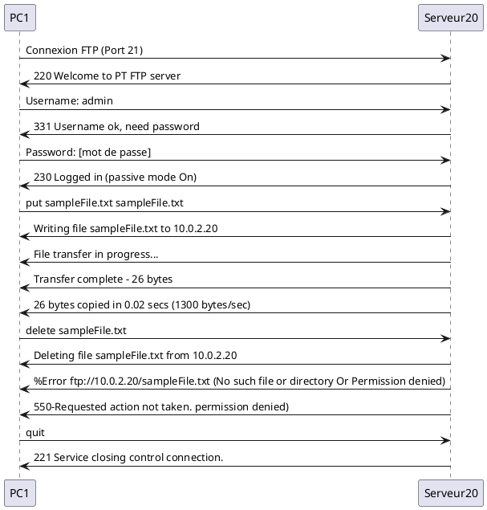
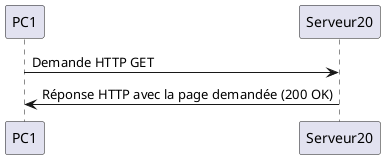

```plantuml
@startuml
participant PC1
participant Serveur20

PC1 -> Serveur20: Connexion FTP (Port 21)
Serveur20 -> PC1: 220 Welcome to PT FTP server
PC1 -> Serveur20: Username: admin
Serveur20 -> PC1: 331 Username ok, need password
PC1 -> Serveur20: Password: [mot de passe]
Serveur20 -> PC1: 230 Logged in (passive mode On)
PC1 -> Serveur20: put sampleFile.txt sampleFile.txt
Serveur20 -> PC1: Writing file sampleFile.txt to 10.0.2.20
Serveur20 -> PC1: File transfer in progress...
Serveur20 -> PC1: Transfer complete - 26 bytes
Serveur20 -> PC1: 26 bytes copied in 0.02 secs (1300 bytes/sec)
PC1 -> Serveur20: delete sampleFile.txt
Serveur20 -> PC1: Deleting file sampleFile.txt from 10.0.2.20
Serveur20 -> PC1: %Error ftp://10.0.2.20/sampleFile.txt (No such file or directory Or Permission denied)
Serveur20 -> PC1: 550-Requested action not taken. permission denied)
PC1 -> Serveur20: quit
Serveur20 -> PC1: 221 Service closing control connection.
@enduml
```

```plantuml
@startuml
participant PC1
participant Serveur20

PC1 -> Serveur20: Demande HTTP GET
Serveur20 -> PC1: Réponse HTTP avec la page demandée (200 OK)
@enduml
```
